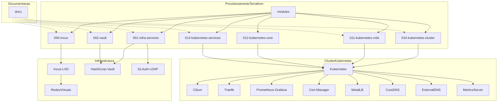

# Platform Control

Uma plataforma de infraestrutura como código completa para deploy e gerenciamento de aplicações usando Incus, Vault, Kubernetes e outras tecnologias modernas.



## 🎯 Visão Geral

Este projeto implementa uma infraestrutura completa de desenvolvimento e produção usando:

- **🏠 Incus (LXD)**: Containerização e virtualização
- **🔐 HashiCorp Vault**: Gerenciamento de segredos e PKI
- **📁 GLAuth**: Servidor LDAP leve
- **☸️ Kubernetes**: Orquestração de containers
- **🌐 Cilium**: Networking e observabilidade
- **🚀 Traefik**: Ingress Controller e Load Balancer
- **📊 Prometheus + Grafana**: Monitoramento e métricas

## 📁 Estrutura do Projeto

```
plataform-control/
├── docs/                           # Documentação
│   ├── incus_install.md            # Instalação do Incus
│   ├── incus_init.md               # Configuração inicial
│   ├── incus-ui-setup.md           # Interface web
│   ├── ovn_configure.md            # Networking OVN
│   └── packer_build.md             # Build de imagens
├── terraform/                      # Infraestrutura como código
│   ├── 000-incus/                  # Configuração base do Incus
│   ├── 001-infra-services/         # Vault + GLAuth (LDAP)
│   ├── 002-vault/                  # Configuração do Vault
│   ├── 010-kubernetes-cluster/     # Cluster Kubernetes
│   ├── 011-kubernetes-crds/        # CRDs do Kubernetes
│   ├── 012-kubernetes-core/        # Componentes core (Cilium, etc)
│   ├── 013-kubernetes-services/    # Serviços de aplicação
│   └── modules/                    # Módulos reutilizáveis
└── README.md                       # Este arquivo
```

## 🚀 Quick Start

### Pré-requisitos

- Ubuntu/Debian Linux
- Terraform >= 1.12.0
- Incus/LXD instalado e configurado
- Acesso sudo

### 1. Instalação e Configuração Inicial

```bash
# Clone o repositório
git clone https://github.com/Tech-Preta/plataform-control.git
cd plataform-control

# Siga a documentação para instalar o Incus
cat docs/incus_install.md
cat docs/incus_init.md
```

### 2. Deploy da Infraestrutura Base

```bash
# 1. Configurar redes e storage do Incus
cd terraform/000-incus
cp terraform.tfvars.example terraform.tfvars
# Edite as variáveis conforme seu ambiente
terraform init
terraform plan
terraform apply

# 2. Deploy dos serviços de infraestrutura (Vault + LDAP)
cd ../001-infra-services
cp terraform.tfvars.example terraform.tfvars
# Configure suas credenciais
terraform init
terraform plan
terraform apply

# 3. Configurar o Vault
cd ../002-vault
cp terraform.tfvars.example terraform.tfvars
# Configure o token do Vault obtido na etapa anterior
terraform init
terraform plan
terraform apply
```

### 3. Deploy do Cluster Kubernetes

```bash
# 4. Criar cluster Kubernetes
cd ../010-kubernetes-cluster
terraform init
terraform apply

# 5. Instalar CRDs
cd ../011-kubernetes-crds
terraform init
terraform apply

# 6. Componentes core (Cilium, Traefik, etc)
cd ../012-kubernetes-core
terraform init
terraform apply

# 7. Serviços de aplicação
cd ../013-kubernetes-services
terraform init
terraform apply
```

## 🔧 Configuração

### Variáveis de Ambiente

Crie um arquivo `.env` na raiz do projeto (não commitado):

```bash
# Vault
export VAULT_ADDR="https://10.191.1.101:8200"
export VAULT_TOKEN="seu-vault-token-aqui"
export VAULT_SKIP_VERIFY=true

# LDAP
export LDAP_URL="ldap://10.191.1.100:3893"
export LDAP_BIND_DN="cn=granato,dc=nataliagranato,dc=xyz"
export LDAP_BIND_PASSWORD="sua-senha-aqui"
```

**Importante:** O arquivo `.env` contém informações sensíveis e **não deve ser commitado** no repositório Git. Certifique-se de que ele esteja listado no seu arquivo `.gitignore`. Para ambientes de produção, considere o uso de um sistema de gerenciamento de segredos mais robusto integrado ao seu pipeline de CI/CD.

### Redes

A plataforma usa as seguintes redes:

- **infra-unified**: `10.191.1.0/24` - Serviços de infraestrutura
- **kubernetes**: `10.191.0.0/24` - Cluster Kubernetes
- **lxdbr0**: `10.0.0.0/24` - Rede padrão do Incus

## 🏗️ Componentes

### 000-incus
Configuração base do Incus incluindo:
- Projetos (infra, apps)
- Redes OVN
- Storage pools
- Perfis de containers/VMs

### 001-infra-services
Deploy dos serviços essenciais:
- **HashiCorp Vault**: Gerenciamento de segredos
- **GLAuth**: Servidor LDAP para autenticação
- **Certificados TLS**: Para comunicação segura

### 002-vault
Configuração avançada do Vault:
- Autenticação LDAP
- Políticas RBAC
- PKI Infrastructure
- Secret engines (KV)

### 010-kubernetes-cluster
Deploy do cluster Kubernetes:
- Control plane (HA opcional)
- Worker nodes
- Kubeconfig gerado automaticamente

### 011-kubernetes-crds
Custom Resource Definitions:
- Traefik CRDs
- Prometheus Operator CRDs
- Outros operadores

### 012-kubernetes-core
Componentes essenciais:
- **Cilium**: CNI + Service Mesh
- **Traefik**: Ingress Controller
- **Cert-Manager**: Gerenciamento de certificados
- **MetalLB**: Load Balancer
- **CoreDNS**: DNS
- **Metrics Server**: Métricas de recursos

### 013-kubernetes-services
Serviços de aplicação:
- Integração com Vault
- Monitoramento (Prometheus/Grafana)
- Logging centralizado

## 🌐 Acesso aos Serviços

Após o deploy completo:

### Vault
- **URL**: https://10.191.1.101:8200
- **Autenticação**: LDAP ou token
- **Usuários padrão**: granato, vaultadmin

### LDAP (GLAuth)
- **URL**: ldap://10.191.1.100:3893
- **Base DN**: dc=nataliagranato,dc=xyz
- **Usuários**: ou=admin,ou=users,dc=nataliagranato,dc=xyz

### Kubernetes
- **Kubeconfig**: `terraform/010-kubernetes-cluster/kubeconfig`
- **API Server**: https://10.191.0.3:6443

### Traefik Dashboard
- **URL**: http://traefik.local (configure DNS local)
- **API**: https://10.191.0.3:9000

## 🛠️ Operações

### Backup

```bash
# Backup do Vault
vault operator raft snapshot save vault-backup-$(date +%Y%m%d).snap

# Backup do estado do Terraform
find terraform/ -name "terraform.tfstate" -exec cp {} backups/ \;

# Backup do Kubernetes
kubectl get all --all-namespaces -o yaml > k8s-backup-$(date +%Y%m%d).yaml
```

### Monitoramento

```bash
# Status dos serviços
incus list --all-projects
kubectl get nodes
kubectl get pods --all-namespaces

# Logs
incus exec vault-01 -- journalctl -u vault
kubectl logs -n kube-system -l app=cilium
```

### Destruição Completa

⚠️ **CUIDADO**: Isto removerá toda a infraestrutura!

```bash
# Remover em ordem reversa
cd terraform/013-kubernetes-services && terraform destroy -auto-approve
cd ../012-kubernetes-core && terraform destroy -auto-approve
cd ../011-kubernetes-crds && terraform destroy -auto-approve
cd ../010-kubernetes-cluster && terraform destroy -auto-approve
cd ../002-vault && terraform destroy -auto-approve
cd ../001-infra-services && terraform destroy -auto-approve
cd ../000-incus && terraform destroy -auto-approve

# Limpeza manual se necessário
incus delete --all --force
incus network delete infra-unified kubernetes
```

## 🐛 Troubleshooting

### Problemas Comuns

1. **Vault não responde**
   ```bash
   incus exec vault-01 -- systemctl status vault
   incus exec vault-01 -- journalctl -u vault -f
   ```

2. **Kubernetes pods em CrashLoop**
   ```bash
   kubectl describe pod <pod-name>
   kubectl logs <pod-name> --previous
   ```

3. **Cilium não inicializa**
   ```bash
   kubectl -n kube-system get pods -l k8s-app=cilium
   cilium status --wait
   ```

4. **Problemas de rede**
   ```bash
   incus network list
   incus network show infra-unified
   ovn-nbctl show
   ```

### Logs Importantes

- **Vault**: `/opt/vault/audit.log`
- **GLAuth**: `journalctl -u glauth`
- **Cilium**: `kubectl -n kube-system logs -l k8s-app=cilium`
- **Traefik**: `kubectl -n kube-system logs -l app.kubernetes.io/name=traefik`

## 🤝 Contribuição

1. Fork o projeto
2. Crie uma branch para sua feature (`git checkout -b feature/AmazingFeature`)
3. Commit suas mudanças (`git commit -m 'Add some AmazingFeature'`)
4. Push para a branch (`git push origin feature/AmazingFeature`)
5. Abra um Pull Request

## 📝 Licença

Este projeto está licenciado sob a Licença GPL-3.0 - Veja mais informações em [LICENSE](LICENSE).


## 🙏 Agradecimentos

- **Jonatas Ferreira** - *Trabalho inicial* - [@jonatas-lima](https://github.com/jonatas-lima)

---